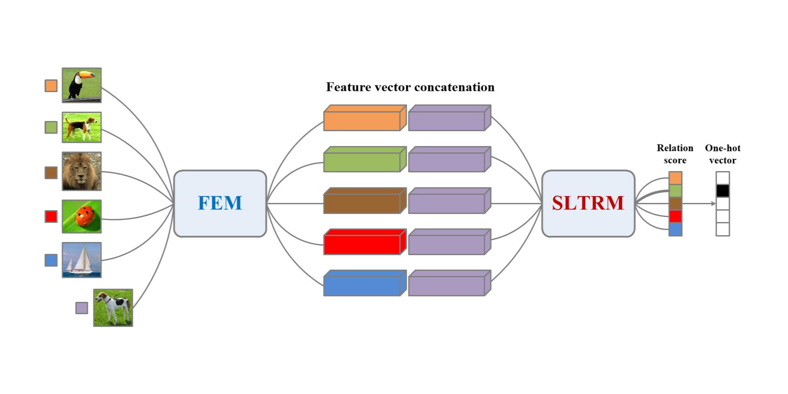

# SLTRN-Sample-level-Transformer-based-Relation-Network-for-few-shot-classification

**Abstract:** Few-shot classification recognizes novel categories with limited labeled samples. The classic Relation Network (RN) compares support-query sample pairs for few-shot classification but overlooks support set contextual information, limiting its comparison capabilities. This work reformulates learning the relationship between query samples and each support class as a seq2seq problem. We introduce a Sample-level Transformer-based relation network (SLTRN) that utilizes sample-level self-attention to enhance the comparison ability of the relationship module by mining potential relationships among support classes. SLTRN demonstrates comparable performance with state-of-the-art methods on benchmarks, particularly excelling in the 1-shot setting with 52.11% and 67.55% accuracy on miniImageNet and CUB, respectively. Extensive ablation experiments validate the effectiveness and optimal settings of SLTRN. Code for experiments in this work can be found at https://github.com/ZitZhengWang/SLTRN.

## Environment
1. python                        3.7.16
2. pytorch                       1.12.1
3. torchvision                   0.13.1
4. tensorboard                   2.6.0

## Getting started
### Data preparation
Both miniImageNet and CUB are public data sets that can be downloaded by yourself.
#### CUB
* Change directory to `./filelists/CUB`
* Unzip the `Caltech-UCSD Birds-200-2011.tgz` file here

    
    like this:
    ------------------------------
    - ./CUB_200_2011/
    - attributes.txt
    - write_CUB_filelist.py
    ------------------------------

* run `python write_CUB_filelist.py`

#### miniImageNet
* Change directory to `./filelists/miniImagenet`

    
    like this:
    ------------------------------
    - ./images/
    - train.csv
    - val.csv
    - test.csv
    - write_miniImagenet_filelist.py
    ------------------------------

* run `python write_miniImagenet_filelist.py` 

### Training
python run_train.py --dataset "Dataset" --shot_num_per_class 1 or 5

    For example:
    python run_train.py --dataset "miniImageNet" --shot_num_per_class 1

    python run_train.py --dataset "miniImageNet" --shot_num_per_class 5
    
    python run_train.py --dataset "CUB" --shot_num_per_class 1

    python run_train.py --dataset "CUB" --shot_num_per_class 5

### Evaluation
python run_test.py --dataset "Dataset" --use_my_model --shot_num_per_class 1 or 5  --load_dir "Specify experiment result path"

    For example:
    python run_test.py --dataset "miniImageNet" --use_my_model --shot_num_per_class 1  --load_dir "Results/exp"
    python run_test.py --dataset "miniImageNet" --use_my_model --shot_num_per_class 5  --load_dir "Results/exp2"
    python run_test.py --dataset "CUB" --use_my_model --shot_num_per_class 1  --load_dir "Results/exp3"
    python run_test.py --dataset "CUB" --use_my_model --shot_num_per_class 5 --load_dir "Results/exp4"

### Use pre-trained models
The pre-trained model can be downloaded from the website `https`

## Other instructions
All parameters are set in config.py

